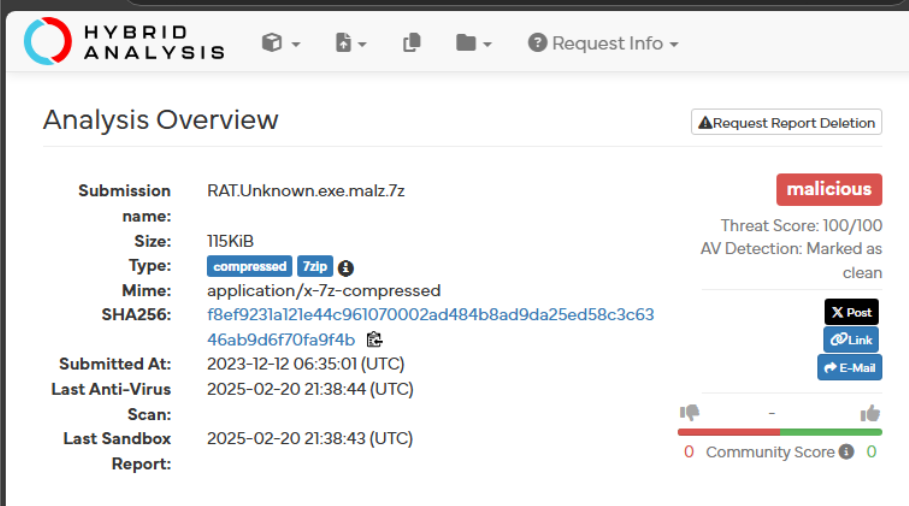
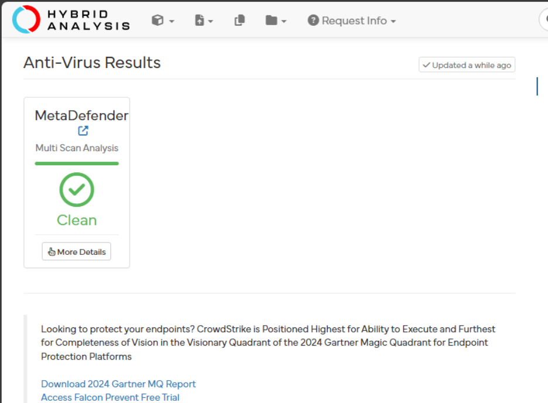
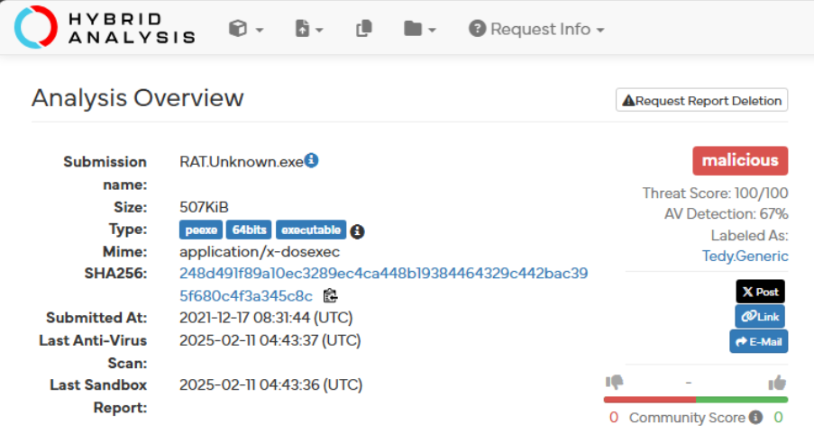
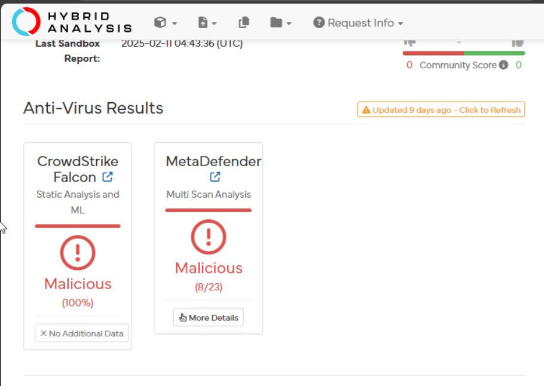
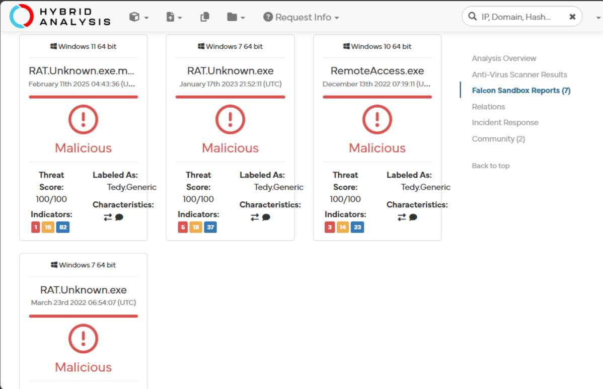
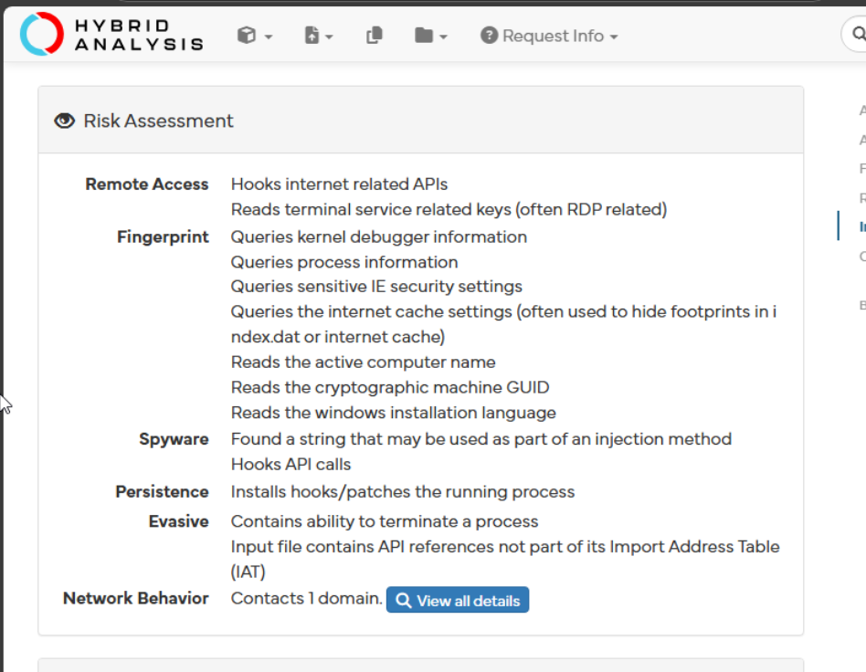
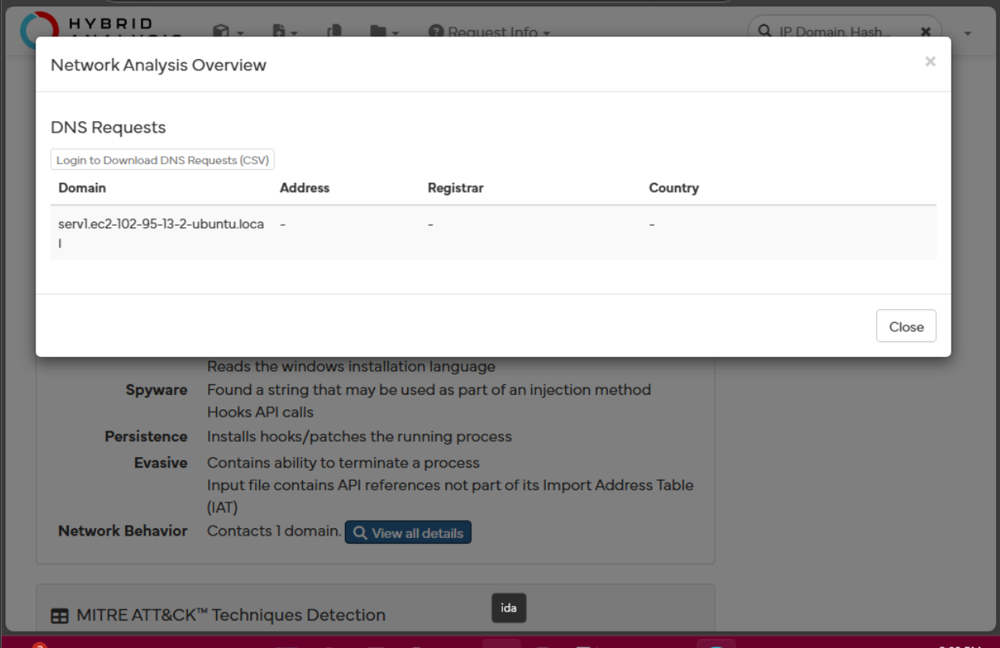

-   Go to hybrid analysis website

    -   Upload the first RAT file

    -   {width="5.691421697287839in"
        height="3.174061679790026in"}

    -   {width="5.567708880139983in"
        height="4.0954779090113735in"}

        -   Based on these observations, hybrid analysis marks this file
            as malicious with a maximum threat score of 100/100

        -   This means that the behavioral indicators detected in the
            sandbox align with known malware activity

        -   In the second screen shot we can see that metadefender sees
            the file as clean. This doesn't mean it is safe however
            because some anti-virus engines do not detect files such as
            these as malicious.

        -   RATs often use obfuscation and packing to bypass AV
            detection

    -   Lets unzip it to further analyze the malware

    -   {width="5.537596237970254in"
        height="2.953384733158355in"}

    -   {width="5.54461832895888in"
        height="3.9363232720909886in"}

    -   

    -   {width="5.161458880139983in"
        height="3.3334416010498686in"}

    -   {width="4.661975065616798in"
        height="3.6160192475940507in"}

    -   {width="4.932292213473316in"
        height="3.201246719160105in"}

        -   We can see that for all versions of windows, it is labeled
            as Tedy.Generic with many indicators. Tedy.Generic indicates
            that it is a generic RAT signature. And the indicators that
            range from 14 to 82 suggest different levels of behavioral
            detections

        -   We can see that the malware adapts to different windows
            versions

        -   Tedy.Generic RAT uses network communication for remote
            control

            -   Capable of process injection, registry modifications,
                and data exfiltration

        -   From the risk assessment we can see the following:

            -   Hooks internet-related APIs → Indicates remote access
                capabilities.

            -   Reads terminal service registry keys → Suggests possible
                RDP abuse.

            -   Queries process and system information → Used for
                environment detection.

            -   Reads cryptographic GUID & IE security settings → May be
                used for anti-analysis and obfuscation.

            -   Hooks API calls → Potential process injection for
                stealthy execution.

            -   Installs hooks/patches running processes → Confirms
                persistence techniques.

            -   Contains ability to terminate a process → Could be used
                to disable security tools.

            -   API references missing from Import Address Table (IAT) →
                Indicates dynamic API resolution for evasion.

        -   Clicking on the network behavior field, we can see that the
            contacted domain is serv1.ec2-102-95-13-2-ubuntu.local

        -   This could be a potential C2 (command and control) server

        -   EC2 ip range also suggests AWS hosting

        -   We also see that it modifies registries

            -   Most likely alters
                HKCU\\Software\\Microsoft\\Windows\\CurrentVersion\\Run

            -   This creates startup entries to execute at boot which
                can be stealthy

        -   Process injection

            -   Hooks into windows processes like explorer.exe,
                svchost.exe

        -   Evasion techniques

            -   Anti debugging

            -   Hiding execution traces

**Question 1**

several indicators suggest that this malware is a Remote Access Trojan
(RAT):

-   Persistence Mechanisms: The malware modifies the registry
    (HKCU\\Software\\Microsoft\\Windows\\CurrentVersion\\Run) to ensure
    execution at startup.

-   Process Injection: Hooks into legitimate Windows processes
    (explorer.exe, svchost.exe) to evade detection and execute malicious
    activities stealthily.

-   Network Communication: Attempts to connect to the domain
    serv1.ec2-102-95-13-2-ubuntu.local, which is hosted on AWS EC2 and
    could serve as a Command & Control (C2) server for remote control.

-   Evasion Techniques: Includes anti-debugging mechanisms, API
    unhooking, and missing API references from the Import Address Table
    (IAT) to avoid detection.

-   Spyware Capabilities: The RAT queries system process information,
    cryptographic machine GUIDs, and IE security settings, which can be
    used for reconnaissance and fingerprinting of the victim's system.

**Question 2**

-   Use endpoint detection and response

-   Restrict execution of powershell and scripting engines

-   Behavioral analysis monitoring

-   Block outbound connections to suspicious domains

-   Monitor dns requests for unusual activity
